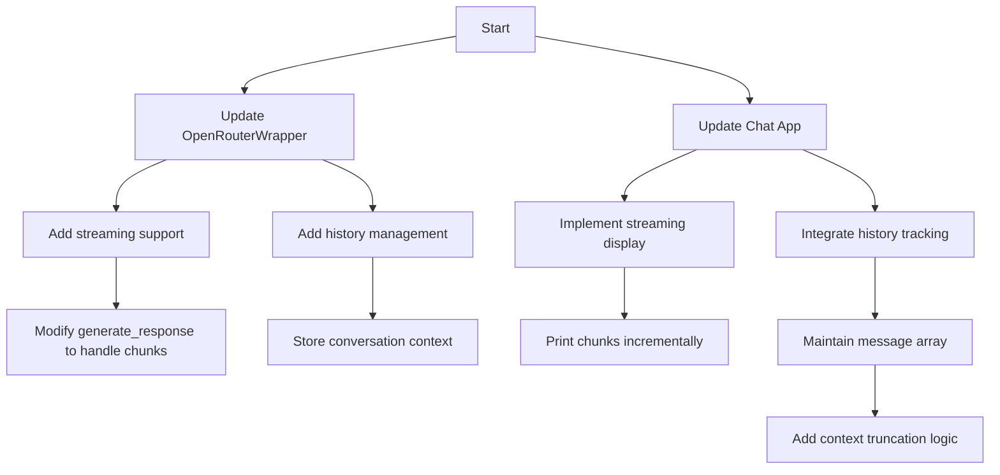

# Ruby Codegen Chat App Enhancement Plan

## Objective
Add streaming responses and chat history to the existing Ruby chat application

## Workflow Overview


## Implementation Steps

### 1. Update OpenRouterWrapper (open_router_wrapper.rb)
- Add `stream` parameter to `generate_response`
- Implement chunk processing using HTTParty's streaming
- Add `messages` parameter to pass conversation history
- Add token counting helper method

### 2. Modify Chat App (chat_app.rb)
- Initialize conversation history array
- Add streaming display logic
- Implement history management:
  - Store each user input and AI response
  - Add context window management (last 5 messages)
- Update exit handling to reset history

### 3. Streaming UX Improvements
- Add typing indicator removal
- Implement clean output formatting
- Add response buff smoother display smoother display

## Key Code Changes Preview

### open_router_wrapper.rb
```ruby
# New generate_response signature
def generate_response(messages, stream: false, &chunk_handler)
  # ... streaming implementation ...
end
```

### chat_app.rb
```ruby
conversation_history = []

loop do
  # ...
  else
    puts "Thinking..."
    conversation_history << {role: "user", content: user_input}
    
    full_response = ""
    llm.generate_response(conversation_history, stream: true) do |chunk|
      print chunk
      full_response << chunk
      STDOUT.flush
    end
    
    conversation_history << {role: "assistant", content: full_response}
    puts "\n"
  end
end
```

## Next Steps
Switch to Code mode to implement these changes