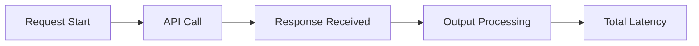
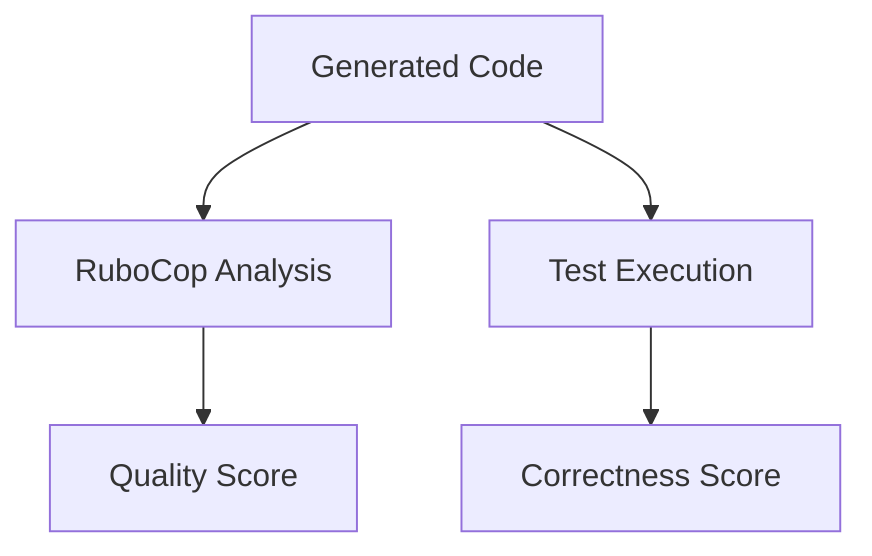
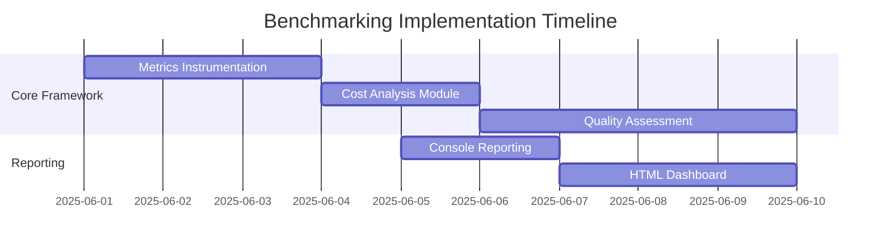

# Ruby CodeGen Benchmarking Plan

## Overview
This document outlines the benchmarking framework Ruby code Ruby code generation tool. The primary focus is on establishing metrics for performance, cost, and code quality to evaluate and improve our code generation capabilities.

## Key Components

### 1. Performance Metrics


- **Latency Tracking**: Time from request initiation to final output
- **Token Usage**: Input/output token counts
- **Throughput**: Generations per minute under load

### 2. Cost Analysis
```ruby
# Pseudocode for cost calculation
def calculate_cost(input_tokens, output_tokens)
  input_price = ModelConfig.for(model).input_price
  output_price = ModelConfig.for(model).output_price
  (input_tokens / 1000.0 * input_price) + (output_tokens / 1000.0 * output_price)
end
```

- Cost per generation
- Model comparison dashboard
- Budget alerting system

### 3. Quality Assessment


- Code quality metrics (offense count, complexity)
- Correctness verification via test execution
- Composite quality score algorithm

## Implementation Roadmap


## File Structure
```
ruby_codegen_app/
├── services/
│   ├── benchmark_runner.rb     # Orchestrates benchmarking
│   ├── quality_assessor.rb     # Runs RuboCop and tests
│   └── cost_analyzer.rb        # Calculates generation costs
├── lib/
│   └── reporting/
│       ├── console_reporter.rb # CLI output
│       └── html_dashboard.rb   # Visual dashboard
├── benchmark_suite/            # Standard test cases
│   ├── fizzbuzz.rb
│   ├── quicksort.rb
│   └── api_client.rb
└── tasks/
    └── benchmark.rake          # Rake task for benchmarking
```

## Next Steps
1. Implement instrumentation in `CodeGenerator`
2. Create `BenchmarkRunner` service
3. Develop reporting modules
4. Add Rake task for automated benchmarking