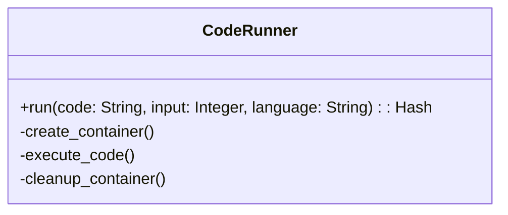

# Code Generation Enhancement Plan

## Objective
Enhance our Ruby code generation application to:
1. Handle more complex problems beyond FizzBuzz
2. Safely execute generated code
3. Dockerize the application
4. Verify output correctness

## Phase 1: Core Execution Capability

### Problem Selection
- **Problem**: Prime Factorization
- **Input**: Integer (n > 1)
- **Output**: Array of prime factors
- **Examples**:
  - `prime_factors(60) => [2, 2, 3, 5]`
  - `prime_factors(17) => [17]`
  - `prime_factors(1) => Error`

### CodeRunner Service


**Features**:
- Uses Docker API for sandboxing
- Timeout handling (5s default)
- Resource limits (CPU/memory)
- Read-only filesystem
- No network access
- STDIN/STDOUT communication

## Phase 2: Verification System

### Test Harness
```ruby
class CodeVerifier
  def verify(problem, generated_code, test_cases)
    # 1. Run code through CodeRunner
    # 2. Compare actual vs expected output
    # 3. Calculate success rate
  end
end
```

**Test Cases**:
```ruby
TEST_CASES = {
  60 => [2, 2, 3, 5],
  17 => [17],
  1 => ArgumentError
}
```

## Phase 3: Dockerization

### Dockerfile
```dockerfile
FROM ruby:3.3-slim
WORKDIR /app
COPY . .
RUN bundle install
CMD ["ruby", "chat_app.rb"]
```

### docker-compose.yml
```yaml
version: '3.8'
services:
  codegen:
    build: .
    volumes:
      - .:/app
    environment:
      - OPENROUTER_API_KEY=${OPENROUTER_API_KEY}
```

## Implementation Roadmap
1. Implement `CodeRunner` service
2. Create Docker execution environment
3. Add prime factorization prompt handling
4. Build verification system
5. Dockerize application
6. Document build/run process

## Phase 4: Future Extensions
- Multi-language support
- Expanded problem library
- Performance benchmarking

## Testing

To verify the system:

```bash
# Run prime factorization tests
./ruby_codegen_app/test_harness/scripts/test_prime_factors.sh

# Generate custom code
bundle exec rake codegen:generate["your prompt"]
```

Key paths:
- Generated code: `ruby_codegen_app/generated_code/`
- Test scripts: `ruby_codegen_app/test_harness/scripts/`