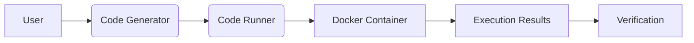

# Code Generation Experiment Guide

## 1. Overview
This experiment demonstrates automated code generation and execution for the prime factorization problem. The system:
- Generates Ruby code using LLMs
- Executes code in Docker containers
- Verifies output against test cases

## 2. Architecture


### Components:
- **Code Generator**: `services/code_generator.rb`
- **Code Runner**: `services/code_runner.rb`
- **Test Harness**: `test_harness/scripts/`

## 3. Setup
### Prerequisites:
- Docker installed and running
- Ruby 3.3+
- Bundler gem

### Installation:
```bash
cd ruby_codegen_app
bundle install
docker pull ruby:3.3-slim
```

## 4. Running the Experiment
### Generate and test prime factorization:
```bash
./test_harness/scripts/test_prime_factors.sh
```

### Custom code generation:
```bash
bundle exec rake codegen:generate["Your prompt here"]
```

## 5. Security Considerations
While basic containerization is used, this experiment:
- Assumes generated code is non-malicious
- Uses default Docker security settings
- Limits execution time to 5 seconds
- Restricts memory to 100MB

For production use, implement the full [security policy](security_policy.md).

## 6. Example Output
Successful execution should show:
```
Generating code for: Write a Ruby program...
Test Results:
Testing with input: 60
✅ PASSED
```

## 7. Future Enhancements
1. Add more problems (pathfinding, sorting)
2. Implement multi-language support
3. Add performance metrics
4. Enhance security incrementally

## 8. Troubleshooting
- **Docker issues**: Run `docker system prune -a` and retry
- **Test failures**: Check generated code in `generated_code/`
- **Timeout errors**: Increase timeout in `CodeRunner::DEFAULT_TIMEOUT`