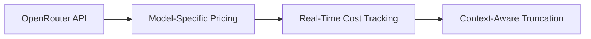
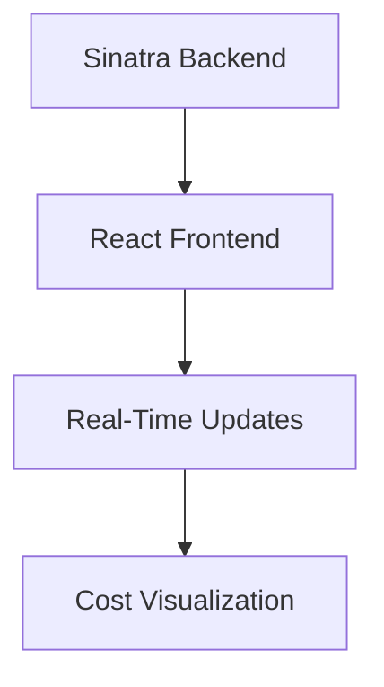
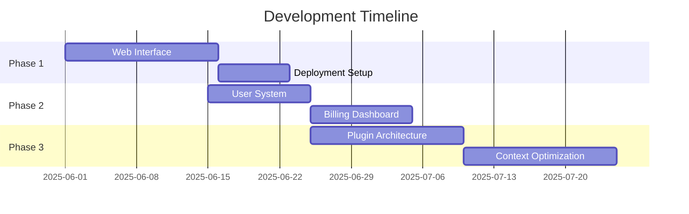

# Ruby Codegen Chat App - Progress Report & Future Plans

## Completed Work (May 2025)

### Token Management System

- Implemented dynamic token counting for DeepSeek models
- Created cost calculator with provider-specific pricing
- Added token usage display in chat interface
- Implemented API-driven model configuration

### DeepSeek Integration
- Full support for DeepSeek-R1-0528 and DeepSeek-V3 models
- Custom tokenizer handling
- Adaptive context management (128K tokens)
- Provider selection logic (InferenceNet, DeepInfra, etc.)

### Performance Improvements
- Streaming response optimization
- Conversation history compression
- Token counting efficiency gains
- Error handling and fallback mechanisms

## Key Learnings

1. **API Integration Complexity**
   - OpenRouter's endpoint structure required multiple iterations
   - Pricing data varies significantly between providers
   - Solution: Implemented smart endpoint selection

2. **Visibility Challenges**
   - Ruby's implicit method visibility caused runtime errors
   - Solution: Explicit public/private declarations

3. **Cost Precision**
   - Micro-transactions require high-precision arithmetic
   - Solution: Decimal-based calculations with full precision display

## Upcoming Ideas

### Web Interface (Phase 1)

- Browser-based chat experience
- Responsive design for all devices
- Real-time token/cost tracking
- Conversation history visualization

### Multi-User Support (Phase 2)
- User authentication system
- Conversation persistence
- Personalized model preferences
- Usage analytics dashboard

### Advanced Features (Phase 3)
- **Plugin System**
  - File attachment processing
  - Code execution sandbox
  - Custom tool integrations
- **Context Optimization**
  - Automatic summarization
  - Importance-based retention
  - External knowledge retrieval
- **Collaboration Tools**
  - Shared conversation spaces
  - Team billing management
  - Annotation system

## Implementation Roadmap

## Next Steps

1. Prioritize web interface implementation
2. Research Sinatra+React integration patterns
3. Design user authentication flow
4. Create plugin API specification

Let's discuss which initiative we should tackle first!