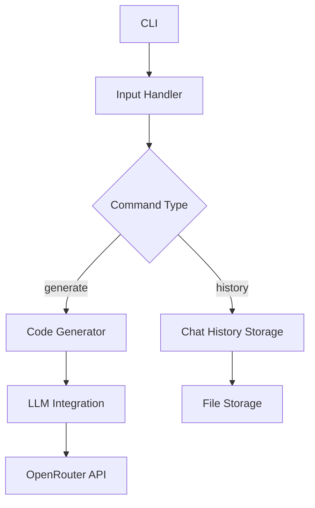

# Phased Plan for Ruby CLI Codegen Agent

This document outlines the phased approach to developing a Ruby CLI application that acts as a simple code generation agent. The app will feature a REPL-like interface, integration with OpenRouter for LLM capabilities, and storage of chat history on disk.

## Phased Plan

### Phase 1: Requirements Gathering and Analysis
- **Activities**: 
  - Define the scope, including generating basic Ruby code snippets.
  - Identify input methods (e.g., command-line arguments).
  - Determine output formats (e.g., generated files).
- **Deliverables**: Documented features and acceptance criteria.

### Phase 2: Design and Architecture
- **Activities**: 
  - Design CLI structure using Thor.
  - Plan chat history storage (e.g., JSON file).
  - Integrate with OpenRouter API.
- **Deliverables**: High-level design diagram.

### Phase 3: Implementation
- **Activities**: 
  - Set up project with Gemfile.
  - Implement CLI commands.
  - Write code generation logic.
- **Deliverables**: Functional Ruby script.

### Phase 4: Testing and Validation
- **Activities**: 
  - Write unit and integration tests.
  - Validate generated code and API interactions.
- **Deliverables**: Test suite results.

### Phase 5: Documentation and Packaging
- **Activities**: 
  - Write user documentation.
  - Package the app as a gem.
- **Deliverables**: README, gemspec file.

## Architecture Diagram

## Conclusion
This plan provides a structured approach to building the Ruby CLI codegen agent. Each phase ensures incremental development with testing and refinement.