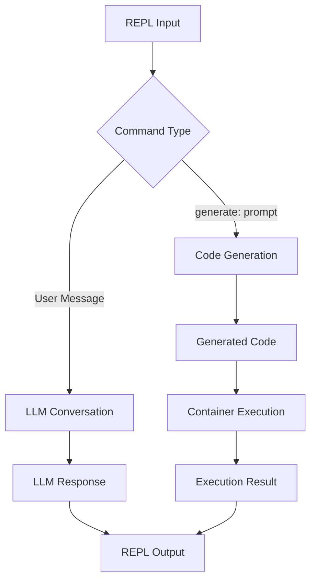
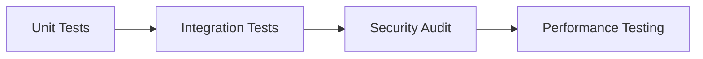

# Ruby CodeGen REPL Enhancement Roadmap

## 1. Architecture Overview


## 2. Implementation Phases

### Phase 1: Core Functionality
- Implement LLM conversation flow (`chat:` command)
- Build code generation pipeline
- Integrate container execution service
- Target completion: 1 week

### Phase 2: Security & Reliability
- Add syntax validation for generated code
- Implement resource limits for containers
- Enhance error handling
- Target completion: 2 weeks

### Phase 3: User Experience
- Improve history management
- Add command autocompletion
- Implement colored output formatting
- Target completion: 1 week

## 3. File Modifications

### `chat_repl/repl.rb`
- Add new command handlers
- Integrate LLM client
- Refactor execution flow

### `services/code_generator.rb`
- Implement LLM-based code generation
- Add syntax validation

### `services/code_runner.rb`
- Enhance container execution
- Add resource limits

## 4. Dependencies
- OpenRouter API key
- Docker runtime
- Additional gems: 
  - `openrouter`
  - `ruby-openai`

## 5. Testing Strategy


## 6. Timeline
```mermaid
gantt
    title Project Timeline
    dateFormat  YYYY-MM-DD
    section Core
    LLM Integration       :a1, 2025-06-01, 5d
    Code Generation       :a2, after a1, 5d
    Container Execution   :a3, after a2, 3d
    section Security
    Validation            :2025-06-10, 4d
    Sandboxing            :2025-06-14, 3d
    section UX
    History Management    :2025-06-17, 2d
    Autocompletion        :2025-06-19, 2d