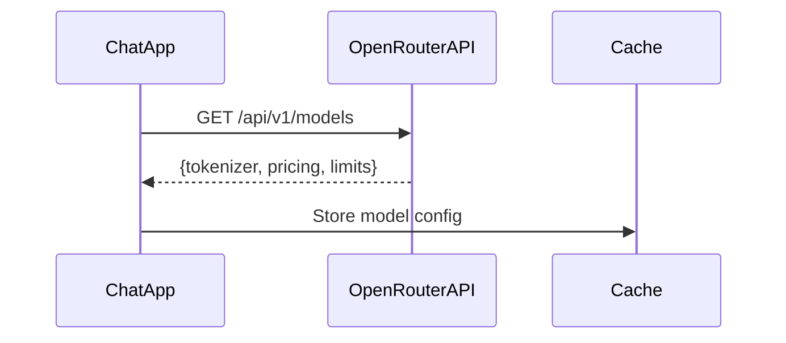
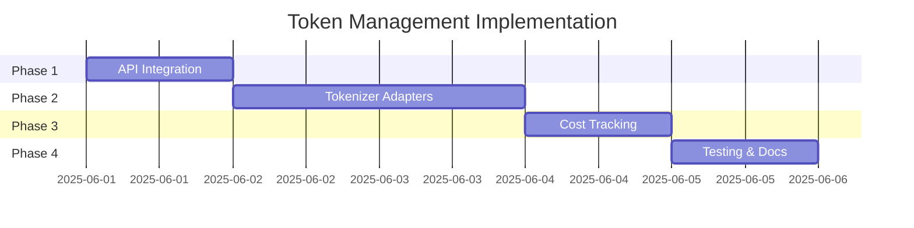

# Token Management Enhancement Plan

## Overview
This document outlines the API-driven approach to token management for DeepSeek models (R1-0528 and V3) via OpenRouter. The system will dynamically determine tokenizers and pricing based on OpenRouter's API, enabling accurate token counting and cost tracking.

## Goals
1. **Dynamic Tokenizer Selection**: Automatically determine tokenizers via API
2. **Real-time Cost Tracking**: Calculate usage costs based on current pricing
3. **Model-Aware Context Management**: Apply model-specific token limits
4. **Graceful Degradation**: Handle API failures gracefully

## Implementation Phases

### Phase 1: API Integration (1 day)


- **Components**:
  - `model_config.rb`: Service to fetch and cache model data
  - API client with exponential backoff retries
  - Local cache with TTL (1 hour)

### Phase 2: Tokenizer Abstraction (2 days)
```ruby
class TokenUtils
  TOKENIZER_ADAPTERS = {
    tiktoken: TiktokenAdapter,
    huggingface: HuggingFaceAdapter,
    default: CharacterCountAdapter
  }

  def self.count_tokens(model, text)
    adapter = TOKENIZER_ADAPTERS[config.adapter_type].new(model)
    adapter.count(text)
  end
end
```

- **Adapters**:
  - Tiktoken (OpenAI models)
  - Hugging Face (DeepSeek models)
  - Character-based fallback

### Phase 3: Cost Tracking (1 day)
- **Features**:
  - Real-time cost display in chat
  - Session cost summaries
  - Usage analytics
- **Implementation**:
  ```ruby
  class Conversation
    attr_accessor :input_tokens, :output_tokens
    
    def cost
      CostCalculator.calculate(@model, input_tokens, output_tokens)
    end
  end
  ```

### Phase 4: Testing & Documentation (1 day)
- **Test Coverage**:
  - API response handling
  - Token counting accuracy
  - Cost calculation scenarios
- **Documentation**:
  - Configuration guide
  - Troubleshooting manual
  - API reference

## Risk Analysis

| Risk | Probability | Impact | Mitigation Strategy |
|------|-------------|--------|---------------------|
| API rate limiting | Medium | High | Exponential backoff with jitter |
| Tokenizer mismatch | Low | Medium | Manual override configuration |
| Pricing changes | Medium | Low | Daily cache invalidation |
| Network failures | High | Medium | Graceful degradation mode |

## Timeline


## Configuration Reference
```env
# .env.example
OPENROUTER_API_KEY=your_key
TOKEN_CACHE_TTL=3600
FALLBACK_TOKENIZER=character
```

## Dependencies
- `faraday` for HTTP requests
- `huggingface_tokenizers` gem
- `tiktoken_ruby` gem (legacy support)